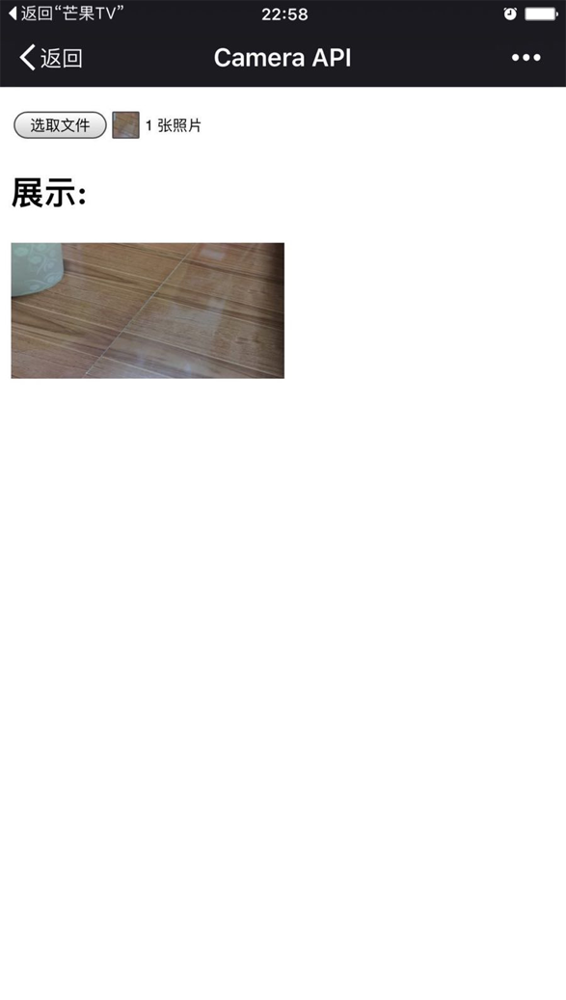

# Camera API的使用

通过[Camera API](https://wiki.mozilla.org/Platform/Features/Camera_API),你可以使用手机的摄像头拍照,然后把拍到的照片发送给当前网页.这些操作主要是通过一个input元素来实现的,其中该元素的type属性必须为"file",accept属性要允许图片格式,这样才能知道这个文件选择框是用来选择图片的.,完整的HTML结构看起来是这样的:

```
<input type="file" id="take-picture" accept="image/*">
```

当用户激活这个HTML元素的时候,系统会呈现给用户一个选择界面,其中一个选项是选择本地的图片文件,另一个选项是要通过摄像头直接 拍摄照片作为所选文件.如果用户选择了摄像头,则会进入手机的拍照模式.拍照结束后,,用户可以选择确定还是放弃.如果接受了,则该照片会作为所选文件发 送给那个<input type="file">元素,同时触发该元素的onchange事件.

## 获取到所拍摄照片的引用

通过[File API](https://developer.mozilla.org/en-US/docs/Web/API/File/Using_files_from_web_applications),你可以获取到用户所拍摄的照片或者所选择的图片文件的引用:

```
var takePicture = document.querySelector("#take-picture");
takePicture.onchange = function (event) {
    // 获得图片文件的引用
    var files = event.target.files,
        file;
    if (files && files.length > 0) {
        file = files[0];
    }
};
```

## 在网页中展示图片

如果你获取到了那张照片的引用(也就是File对象),你就可以使用`window.URL.createObjectURL()`方法创建一个指向那个照片的URL,然后把得到的URL赋给img元素的src属性:

```
// 获取到img元素
var showPicture = document.querySelector("#show-picture");

// 获取到window.URL对象
var URL = window.URL || window.webkitURL;

// 创建一个对象URL字符串
var imgURL = URL.createObjectURL(file);

// 设置img元素的src属性为那个URL
showPicture.src = imgURL;

// 释放那个对象URL,提高性能
URL.revokeObjectURL(imgURL);
```

如果浏览器不支持createObjectURL()方法,还可以使用FileReader来实现:

```
// 如果createObjectURL方法不可用
var fileReader = new FileReader();
fileReader.onload = function (event) {
    showPicture.src = event.target.result;
};
fileReader.readAsDataURL(file);
```

### 效果图



> 完整代码请看index.html
